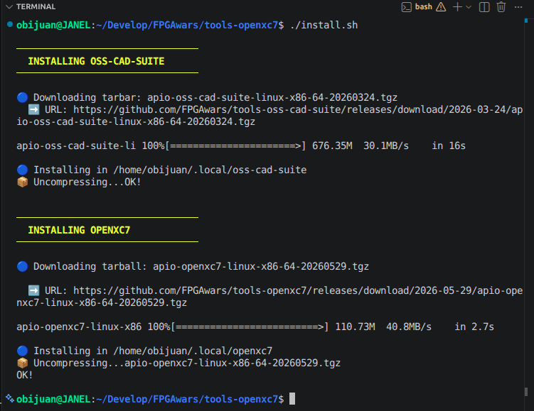
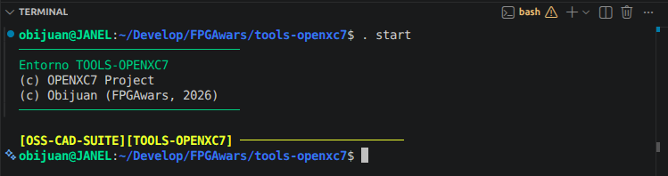
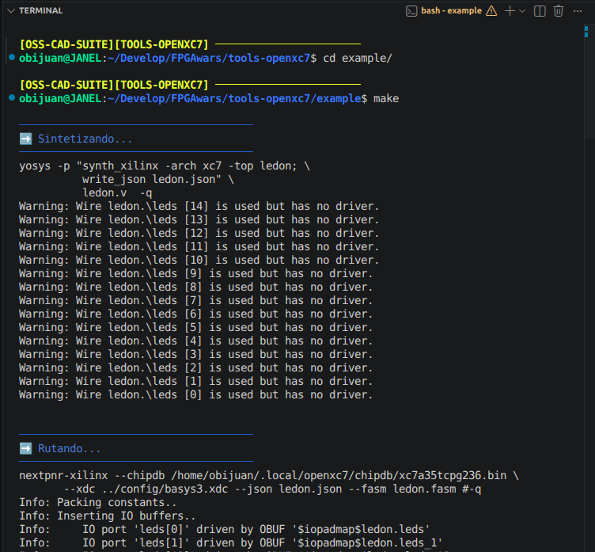
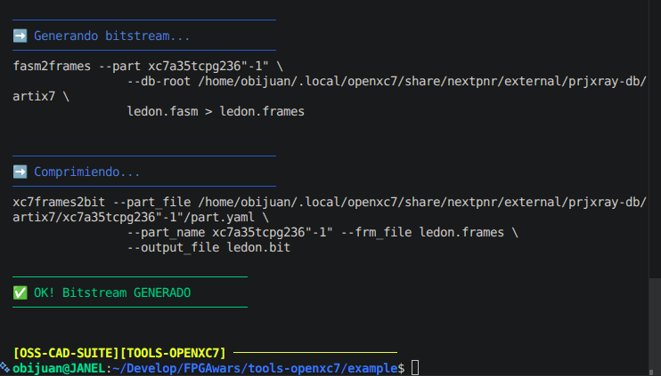
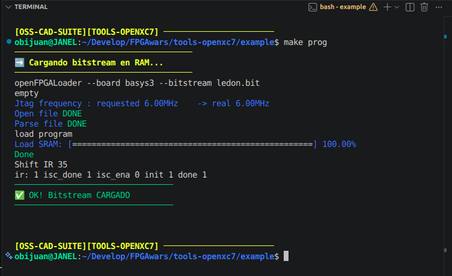
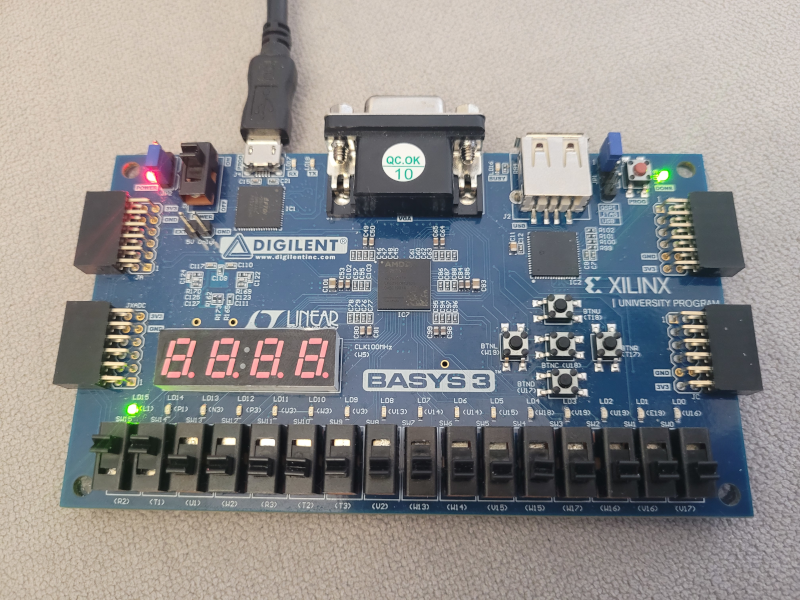

# tools-openxc7

> **Note:** Please **do not** open issues in this repository.
> For any questions, discussions, or bug reports, use the [main Apio repository](https://github.com/FPGAwars/apio).

Apio package with selected binaries from the [openXC7 project](https://github.com/openxc7)

## Supported platforms

| OS      | Arch            | Package token   | Status |
|---------|-----------------|-----------------|--------|
| Linux   | x86_64          | `linux-x86-64`  | ✅ supported |
| macOS   | Apple Silicon   | `darwin-arm64`  | ✅ supported |
| macOS   | Intel (x86_64)  | `darwin-x86-64` | ⚠️ best effort |
| Linux   | aarch64         | `linux-aarch64` | ⚠️ best effort |

Packages are published per OS/arch and coexist in the same dated release:
`apio-openxc7-<os>-<arch>-<date>.tgz`. The installer auto-detects the platform.

## Building the toolchain (For developers)

The build is reproducible with Nix and runs natively on **Linux** and
**macOS (Apple Silicon)**. There is no cross-compilation: each package is built
on its own machine (CI uses an `ubuntu-latest` + `macos-14` matrix).

Follow theses steps:

1. Install [Nix](https://nixos.org/download/#download-nix)
2. Clone this repo
3. From the repo's home folder execute `nix develop`
    * The first time it will take around 20 minutos to finish
    * All the tools will be built
    * After that, you will see the prompt: `[nix(openXC7)] `
    * Next execution of `nix develop` will take seconds
4. From the nix environment execute `./openxc7-pack.py`

    It will collect all the necesary binaries an libraries and
generate a tarball. This is what you should see initially:


After some time, it will generate the `apio-openxc7-<os>-<arch>-<version>.tgz`
package for the host platform (e.g. `apio-openxc7-linux-x86-64-<version>.tgz` on
Linux, `apio-openxc7-darwin-arm64-<version>.tgz` on Apple Silicon)


5. You are done! You can use it locally or publish it as a new release

## Using the toolchain without APIO

It is possible to use the complete toolchain directly, without apio. Follow this instructions: 

### 1. Clone this repository

* Clone this repository and enter its home directory

```bash
git clone https://github.com/FPGAwars/tools-openxc7.git
cd tools-openxc7
```

### 2. Install the complete toolchain (oss-cad-suite + openxc7)

```bash
./install.sh
```

  It auto-detects your OS/arch (Linux or macOS), downloads the matching .tgz
packages and uncompresses them into the user's folders: `~/.local/oss-cad-suite`
and `~/.local/openxc7`. On macOS the quarantine attribute is stripped so the
binaries run.



### 3. Enter the new environment: `. start`

```bash
. start
```
  Inside this environment you have accesss to all the tools: yosys, nextpnr-xilinx,
openFPGAloader and son on





### 4. Test the "hello world": Turning the LED on

```bash
cd example
make
```




It will generate the Bitstream




### 5. Upload to the Basys3 board

Execute the command `make prog`



The LED 15 of the Basys3 board is now on



## License

The Apio project itself is licensed under the GNU General Public License version 3.0 (GPL-3.0).
Pre-built packages may include third-party tools and components, which are subject to their
respective license terms.
