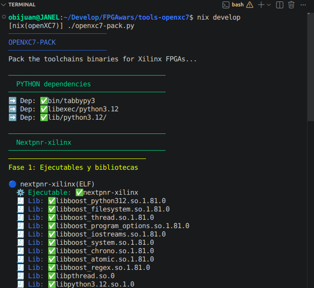
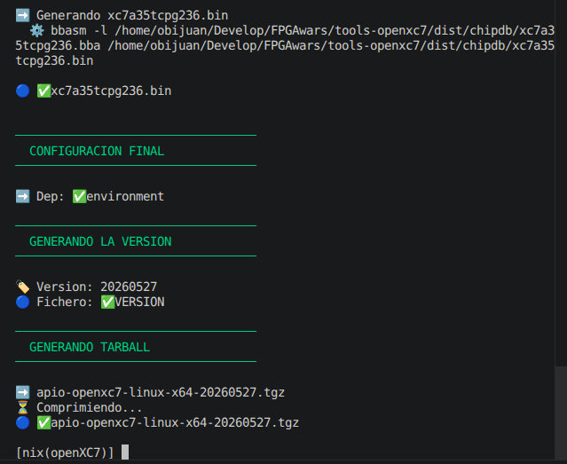

# tools-openxc7

> **Note:** Please **do not** open issues in this repository.
> For any questions, discussions, or bug reports, use the [main Apio repository](https://github.com/FPGAwars/apio).

Apio package with selected binaries from the [openXC7 project](https://github.com/openxc7)  

## Building the toolchain (For developers)

The current process for building the toolchain is manual, and only for 
Linux

Follow theses steps:

1. Install [Nix](https://nixos.org/download/#download-nix)
2. Clone this repo
3. From the repo's home folder execute `nix develop`
    * The first time it will take around 20 minutos to finish
    * All the tools will be built
    * After that, you will see the prompt: `[nix(openXC7)] `
    * Next execution of `nix develop` will take seconds
4. From the nix environment execute `./openxc7-pack.py`

    It will collect all the necesary binaries an libraries and
generate a tarball. This is what you should see initially:



After some time, it will generate the `apio-openxc7-linux-x64-<version>.tgz` package



5. You are done! You can use it locally or publish it as a new release

## Using the toolchain without APIO

It is possible to use the complete toolchain directly, without apio. Follow this instructions: `./install.sh`

1. Install the complete toolchain (oss-cad-suite + openxc7)

```bash
./install.sh
```

  It will download the corresponding .tgz packages and uncompressing them in the
 user's folders: `~/.config/openxc7` and `~/.local/openxc7`

2. Enter the new environment: `. start`

```bash
. start
```
  Inside this environment you have accesss to all the tools: yosys, nextpnr-xilinx,
openFPGAloader and son on

3. Test the "hello world": Turning the LED on

```bash
cd example
make
```

It will generate the Bitstream

4. Upload to the Basys3 board

```bash
make prog
```


## License

The Apio project itself is licensed under the GNU General Public License version 3.0 (GPL-3.0).
Pre-built packages may include third-party tools and components, which are subject to their
respective license terms.
